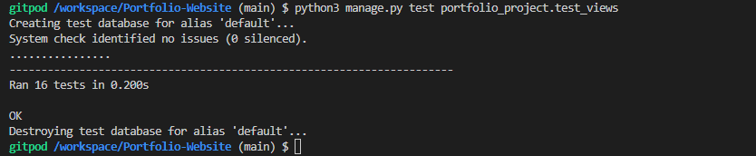

# Portfolio Website for myself! 

Welcome to my Portfolio project, it is about my coding story with information about me, my projects and my story.


## Table of content:

- [Motivation](#motivation)
- [User Experience](#user-experience-ux)
    - [User Stories](#user-stories)
    - [Website Goals](#website-goals)
    - [Requirements](#requirements)
    - [Expectations](#expectations)
    - [Design](#design)
    - [Wireframes](#wireframes)
        - [Desktop](#desktop)
        - [Tablet](#tablet)
        - [Mobile](#mobile)
- [Authentication](#authentication)
- [Data Structure](#data-structure)
- [Website Structure](#website-structure)
- [Technology, Frameworks and Programs used](#technology-frameworks-and-programs-used)
    - [Languages](#languages)
    - [Frameworks and programs used](#frameworks-and-programs-used)
- [Features](#features)
    - [Navigation bar](#navigation)
- [Testing](#testing)
- [Testing user stories](#testing-user-stories)
- [Deployment](#deployment)
- [Credits](#credits)

# Motivation

My motivation for this website is to have my personal portfolio website to put myself out in the tech jobs market.

# User Experience (UX)

## User Stories
- User Story
    - As a user, I want to be able to land on main page.
    - As a user, I want to be able to navigate to About page.
    - As a user, I want to be able to navigate to Projects page.
    - As a user, I want to navigate through website easily.
    - As a user, I want to see projects done by the developer.
    - As a user, I want to be able to visit developer's GitHub.
    - As a user, I want to be able to download CV from Developer.
    - As a user, I want to see where Developer is located.
    - As a user, I want to contact the Developer if I want to message him/her.


## Website Goals

Websites goal is to promote myself as full stack developer and show off my projects and skills I have gained over last few months.

## Agile Methodology

- This project uses Agile methodology with kanban board, each user story is presented as **EPIC** and its smaller issues are **TASKS**

    <details><summary>Picture</summary>
    
    </details>
    <br>

## Requirements

- Landing Page.
- About Page.
- Projects showcase page.
- Download CV.

## Expectations

- I expect my website to be easily accessible.
- I expect my website to attract future employers.
- I expect to showcase my projects and skills.

## Design

- Colors
    - Colors used on website are:

        - White #fff:

        

        - Blue #008cff:

        

        - Grey #333

        

    - Fonts:

    - PT-serif and backup San-serif

        - [Google fonts](https://fonts.google.com/specimen/PT+Serif)

    - Images:

        - Images used from [Pexel image](https://www.pexels.com/photo/hands-typing-on-a-laptop-keyboard-5483077/)


[Back to top](#)

## Wireframes

- Home page.
    <details><summary>Picture</summary>
    
    </details>
    <br>

- About me page.
    <details><summary>Picture</summary>
    
    </details>
    <br>

- Projects page.
    <details><summary>Picture</summary>
    
    </details>
    <br>

- Front panel page.
    <details><summary>Picture</summary>
    
    </details>
    <br>
    <details><summary>Picture</summary>
    
    </details>
    <br>
    <details><summary>Picture</summary>
    
    </details>
    <br>

- Front panel editing pages.
    <details><summary>Picture</summary>
    
    </details>
    <br>

- Hamburger menu.
    <details><summary>Picture</summary>
    
    </details>
    <br>

# Authentication and Security

- Project uses [Allauth](https://django-allauth.readthedocs.io/en/latest/) for login system, allauth base, login and logout was adjusted and styled.
  Random user wont be able to do anything even if they manage to register, front panel has code to check if user is staff and if not red button in the middle pops up to go back to home page.

- Users cannot register this is **personal** Portfolio Project to use in future.

- The register option exists but all admin functionality is protected by the **is_staff**.

    <details><summary>Login</summary>
    
    </details>
    <br>
    <details><summary>Logout</summary>
    
    </details>
    <br>
    <details><summary>if not staff</summary>
    
    </details>
    <br>

- Security

    - All secret keys are stored safely in **envy.py** for development stages and added to Heroku variables for production release.


# Data Structure

## Database 

- Details:
    ```
    id - is automatically generated.

    full_name - CharField

    age - PositiveBigInteger

    nationality - Charfield

    languages - Charfield

    address - CharField
    ```       

- Skills:
    ```
    id - is automatically generated.

    skill - CharField
    ```

- Projects:
    ```
    id - is automatically generated.

    title - CharField

    project_link - URLField

    project_description - TextField

    project_image - CloudinaryField
    ```

    <details><summary>Database structure image</summary>
    
    </details>
    <br>

- Logic

    <details><summary>Database structure image</summary>
    
    </details>
    <br>


# Website structure

- Breakpoints were mostly solved with [bootstrap 5](https://getbootstrap.com/docs/5.1/getting-started/introduction/).

- Breakpoints done by me:
    |  Screen size |  from |  | to breakpoint|
    |---|---|---|---|
    |small|>= 320px| medium | <= 768px |

[Back to top](#)

# Technology, Frameworks and Libraries used.

- [HTML](https://en.wikipedia.org/wiki/HTML5) 

- [CSS](https://en.wikipedia.org/wiki/CSS)

- [Python](https://en.wikipedia.org/wiki/Python_(programming_language))

## Frameworks and Libraries used.

- [Django](https://www.djangoproject.com/) Python-based web framework that follows the model–template–views architectural pattern.

- [Heroku](https://www.heroku.com) Deployment of website.

- [ElephantSQL](https://www.elephantsql.com/) Database storing all schemas and data.

- [Cloudinary](https://cloudinary.com/) Image storage.

- [Gunicorn](https://en.wikipedia.org/wiki/Gunicorn) HTTP server interface.

- [Psycopg](https://wiki.postgresql.org/wiki/Psycopg) Postgres database adaptor.

- [Pexels](https://www.pexels.com/) Free pictures, used on home page.

- [Bootstrap](https://getbootstrap.com/) Bootstrap 5 was used in this project.

- [Balsamiq](https://balsamiq.com/) Wireframes.

- [FontAwesome](https://fontawesome.com/) Icons used in this project.

- [Miniwebtool](https://miniwebtool.com/django-secret-key-generator/) used to generate new key.

- [Google fonts](https://fonts.google.com/) PT-serif was used.

- [Favicon](https://favicon.io/favicon-generator/) Favicon generator.

# Features

- Responsive on all devices.
- Interactive buttons.
- Custom front panel.
- Cloudinary picture storage.

## Navigation

- Hamburger menu and footer.
    - large and big tablets.

        
         

    - Small tablets and mobile.

        
        


- Large devices.

    
    
    

- Tablets.

    

    

    

- Small devices and mobile.

    
    
    

- Front panel which only I have access to.
    - large devices.

    
    
    

    - Tablet and medium devices.

    

    

    

- Small devices dont scale nicely on front panel no pictures to be added.

# Testing

1. W3C HTML Validator, CSS Validator, CI Pylinter.

- HTML
    - All pages visible for user works.

    

    - Error with width and height for index page image, and loading time is justified. Image is loaded from cloudinary and bootstrap is sizing it for me.

    

    - Front panel has warnings about exceeding columns, i have it justified content is rendered in it from database and django autofills them,
     and external user doesnt see it at all. Talked with tutor and he said he cant see any issue with it and that I could flag it as a bug that browser is filling missing or adding extra tags to it. 
<br>
    

- CSS 

    


- Python3

    forms:

    

    models:

    

    views:

    

2. Testing on website.

- Lighthouse:

    - Desktop

        

    - Mobile

        

3. Testing on portable devices.


    I have tested it on my OnePlus phone and in Developer tools. Everything seemed nice.

    Tested more devices two as an example.

    

    

4. Automated testing done by me all passing except URLS showing that imports are not tested.

- Views automatic testing:

    <details><summary>views.py testing</summary>
    
    </details>
    <br>

- Forms automatic testing:

    <details><summary>forms.py testing</summary>
    
    </details>
    <br>

- Models automatic testing:

    <details><summary>models.py testing</summary>
    
    </details>
    <br>

- Coverage:

    <details><summary>coverage</summary>
    
    </details>
    <br>

- URLS not tested shows to test imports?:

    <details><summary>coverage urls</summary>
    
    </details>
    <br>

5. Known bugs.

- CV doesnt download. (Fixed)
- Images wouldnt upload after adding more code to views. (Fixed)
- Front panel, unauthenticated users return button.(fixed)
- Front panel, buttons in project preview grow after fixing html errors.

6. Bugs Fixed.

- CV needed download as attribute in html files, that solved the issue.

- Front panel, unauthenticated return button was fixed by nesting **a** tag in a **div** and moving **id redirection** to **div**, then adding bootstrap class **btn** to it.

<details><summary>Button</summary>

</details>
<br>

- Images fix was adding "request.File" to edit and create functions and "enctype="multipart/form-data" to front-panel.html create form and edit-project.html.
<details><summary>Edit project view</summary>

</details>
<br>
<details><summary>Create project view</summary>

</details>
<br>
<details><summary>Create project form</summary>

</details>
<br>
<details><summary>Edit project form</summary>

</details>
<br>

# Testing user stories

| **Feature**                     | **Action**                          | **Expected Result**                                                                  | **Result** |
|---------------------------------|-------------------------------------|--------------------------------------------------------------------------------------|-------------------|
| As a user, I want to be able to land on main page | Type in websites address | Website will load and go to main page | PASS |
<details><summary>Picture</summary>

</details>
<br>

| **Feature**                     | **Action**                          | **Expected Result**                                                                  | **Result** |
|---------------------------------|-------------------------------------|--------------------------------------------------------------------------------------|-------------------|
| As a user, I want to be able to navigate to about page | While being on home page, click hamburger menu and press **about me** button | By pressing **about me** button, it will lead you to about me page with details and skills | PASS |
<details><summary>Picture</summary>

</details>
<br>

| **Feature**                     | **Action**                          | **Expected Result**                                                                  | **Result** |
|---------------------------------|-------------------------------------|--------------------------------------------------------------------------------------|-------------------|
| As a user, I want to be able to navigate to projects pages | Click on hamburger menu and press **projects** | By pressing **projects** button it will lead you to projects preview page. | PASS |
<details><summary>Picture</summary>

</details>
<br>

| **Feature**                     | **Action**                          | **Expected Result**                                                                  | **Result** |
|---------------------------------|-------------------------------------|--------------------------------------------------------------------------------------|-------------------|
| As a user, I want to navigate through website easily | Press hamburger menu and select any button | By selecting buttons it will lead you to pages accordingly to what you pressed | PASS |
<details><summary>Picture</summary>

</details>
<br>

| **Feature**                     | **Action**                          | **Expected Result**                                                                  | **Result** |
|---------------------------------|-------------------------------------|--------------------------------------------------------------------------------------|-------------------|
| As a user, I want to see projects done by the developer | Press hamburger menu and click **projects** | By selecting **projects** buton it will lead you to projects preview, where you can preview them and open any you want that will lead you to GitHub repository | PASS |
<details><summary>Picture</summary>

</details>
<br>
<details><summary>Picture of repo as example</summary>

</details>
<br>

| **Feature**                     | **Action**                          | **Expected Result**                                                                  | **Result** |
|---------------------------------|-------------------------------------|--------------------------------------------------------------------------------------|-------------------|
| As a user, I want to be able to visit developer's GitHub | Press GitHub icon in **footer** or open **projects** page and click on a link | By selecting any of those, it will lead you to GitHub profile or repository | PASS |
<details><summary>Picture</summary>

</details>
<br>
<details><summary>Picture</summary>

</details>
<br>

| **Feature**                     | **Action**                          | **Expected Result**                                                                  | **Result** |
|---------------------------------|-------------------------------------|--------------------------------------------------------------------------------------|-------------------|
| As a user, I want to be able to download CV from developer | In footer or hamburger menu press **Download** Icon or **CV** button | By pressing those buttons it will download/open my CV for you| PASS |
<details><summary>Picture</summary>

</details>
<br>
<details><summary>Picture</summary>

</details>
<br>

| **Feature**                     | **Action**                          | **Expected Result**                                                                  | **Result** |
|---------------------------------|-------------------------------------|--------------------------------------------------------------------------------------|-------------------|
| As a user, I want to see where Developer is located | Press **about me** page on hamburger menu | About me page tells where developer is located | PASS |
<details><summary>Picture</summary>

</details>
<br>

| **Feature**                     | **Action**                          | **Expected Result**                                                                  | **Result** |
|---------------------------------|-------------------------------------|--------------------------------------------------------------------------------------|-------------------|
| As a user, I want to contact the Developer if I want to message him/her | In **footer** or **CV** there is email provided or email function that will open email draf for you | User gets my email or email inbox opens up with window open to send an email | PASS |
<details><summary>Picture</summary>

</details>
<br>
<details><summary>Picture</summary>

</details>
<br>

# Deployment

**placeholder**

# Credits:

- Slack Community and my Mentor!
- Tutor Support.
- [Simen Daehlin](https://github.com/Eventyret) My Mentor very Helpfull!.
- [Pexels](https://www.pexels.com/) images.
- [The W3C Markup Validation Service](https://validator.w3.org/) Validation of HTML.
- [The W3C CSS Validation Service](https://jigsaw.w3.org/css-validator/) Validation of CSS.
- [Autoprefixer](https://autoprefixer.github.io/) used to prefix CSS.
- [Colorhexa](https://www.colorhexa.com/) was used to take colors from for readme.

