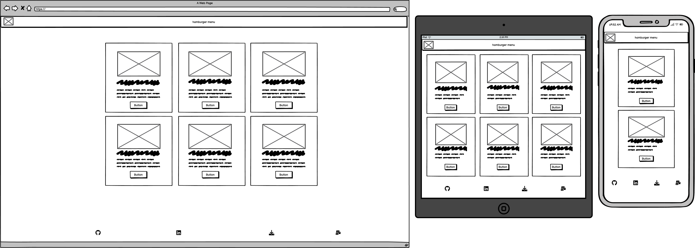

# Portfolio Website for myself! 

Welcome to my Portfolio project, it is about my coding story with information about me, my projects and my story.

**placeholder**

## Table of content:

- [Motivation](#motivation)
- [User Experience](#user-experience-ux)
    - [User Stories](#user-stories)
    - [Website Goals](#website-goals)
    - [Requirements](#requirements)
    - [Expectations](#expectations)
    - [Design](#design)
    - [Wireframes](#wireframes)
        - [Desktop](#desktop)
        - [Tablet](#tablet)
        - [Mobile](#mobile)
- [Website Structure](#website-structure)
- [Technology, Frameworks and Programs used](#technology-frameworks-and-programs-used)
    - [Languages](#languages)
    - [Frameworks and programs used](#frameworks-and-programs-used)
- [Features](#features)
    - [Navigation bar](#navigation-bar)
- [Testing](#testing)
- [Testing user stories](#testing-user-stories)
- [Deployment](#deployment)
- [Credits](#credits)

# Motivation

My motivation for this website is to have my personal portfolio website to put myself out in the tech jobs market.

# User Experience (UX)

## User Stories
- User Story
    - As a user, I want to be able to land on main page.
    - As a user, I want to be able to navigate to About page.
    - As a user, I want to be able to navigate to Projects page.
    - As a user, I want to navigate through website easily.
    - As a user, I want to see projects done by the developer.
    - As a user, I want to be able to visit developer's GitHub.
    - As a user, I want to be able to download CV from Developer.
    - As a user, I want to see where Developer is located.
    - As a user, I want to contact the Developer if I want to message him/her.

## Website Goals

Websites goal is to promote myself as full stack developer and show off my projects and skills I have gained over last few months.

## Requirements

- Landing Page.
- About Page.
- Projects showcase page.
- Download CV.

## Expectations

- I expect my website to be easily accessible.
- I expect my website to attract future employers.
- I expect to showcase my projects and skills.

## Design

- Colors
    - Colors used on website are:

        - White #fff:

        

        - Blue #008cff:

        

        - Grey #333

        

    - Fonts:

    - PT-serif and backup San-serif

        - [Google fonts](https://fonts.google.com/specimen/PT+Serif)

    - Images:

        - Images used from [Pexel image](https://www.pexels.com/photo/hands-typing-on-a-laptop-keyboard-5483077/)

[Back to top](#)

## Wireframes

- Home page.
    

Picture

    
    

     

- About me page.
    

Picture

    
    

     

- Projects page.
    

Picture

    
    

     

- Front panel page.
    

Picture

    
    

     
    

Picture

    
    

     
    

Picture

    
    

     

- Front panel editing pages.
    

Picture

    
    

     

- Hamburger menu.
    

Picture

    
    

     

# Website structure

- Breakpoints were mostly solved with [bootstrap 5](https://getbootstrap.com/docs/5.1/getting-started/introduction/).

- Breakpoints done by me:
    |  Screen size |  from |  | to breakpoint|
    |---|---|---|---|
    |small|>= 320px| medium | <= 768px |

[Back to top](#)

# Technology, Frameworks and Libraries used.

- [HTML](https://en.wikipedia.org/wiki/HTML5) 

- [CSS](https://en.wikipedia.org/wiki/CSS)

- [Python](https://en.wikipedia.org/wiki/Python_(programming_language))

## Frameworks and Libraries used.

- [Django](https://www.djangoproject.com/) Python-based web framework that follows the model–template–views architectural pattern.

- [Heroku](https://www.heroku.com) Deployment of website.

- [ElephantSQL](https://www.elephantsql.com/) Database storing all schemas and data.

- [Cloudinary](https://cloudinary.com/) Image storage.

- [Gunicorn](https://en.wikipedia.org/wiki/Gunicorn) HTTP server interface.

- [Psycopg](https://wiki.postgresql.org/wiki/Psycopg) Postgres database adaptor.

- [Pexels](https://www.pexels.com/) Free pictures, used on home page.

- [Bootstrap](https://getbootstrap.com/) Bootstrap 5 was used in this project.

- [Balsamiq](https://balsamiq.com/) Wireframes.

- [FontAwesome](https://fontawesome.com/) Icons used in this project.

- [Miniwebtool](https://miniwebtool.com/django-secret-key-generator/) used to generate new key.

- [Google fonts](https://fonts.google.com/) PT-serif was used.

- [Favicon](https://favicon.io/favicon-generator/) Favicon generator.

# Features

- Responsive on all devices.
- Interactive buttons.
- Custom front panel.
- Cloudinary picture storage.

## Navigation

- Hamburger menu and footer.
    - large and big tablets.

        
         

    - Small tablets and mobile.

        
        

- Large devices.

    
    
    

- Tablets.

    

    

    

- Small devices and mobile.

    
    
    

- Front panel which only I have access to.
    - large devices.

    
    
    

    - Tablet and medium devices.

    

    

    

- Small devices dont scale nicely on front panel no pictures to be added.

# Testing

1. W3C HTML Validator and CSS Validator

**placeholder**

2. Testing on website.

**placeholder**

3. Testing on portable devices.

**palceholder**

4. Known bugs.

- CV doesnt download (Fixed)

# Testing user stories

| **Feature**                     | **Action**                          | **Expected Result**                                                                  | **Result** |
|---------------------------------|-------------------------------------|--------------------------------------------------------------------------------------|-------------------|
| placeholder | placeholder | placeholder              |

Picture

 

# Deployment

**placeholder**

# Credits:

- <a href="https://www.freepik.com/free-vector/abstract-dark-blue-vector-futuristic-digital-grid-background_16240178.htm#query=website%20background&position=25&from_view=keyword">Image by rawpixel.com</a> on Freepik

**placeholder**